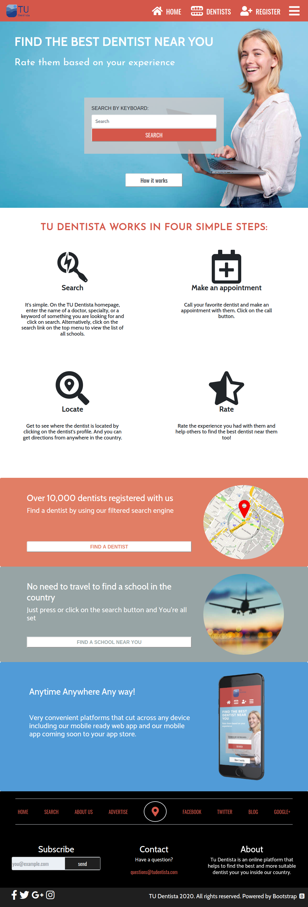

# HTML & CSS Capstone Project: YOUR Dentist (Dentist directory)

> This project is a directory of dentists with filters to find the best option. 

The project has 4 pages: 
- Main/Search
- Results
- Profile
- Register

Responsive design with 3 viewports: 
- mobile: up to 768px
- tablet: up to 1024px
- desktop: from 1024px

Design inspiration by [Mathew Njuguna and others on Behance](https://www.behance.net/gallery/25563385/PatashuleKE)

## Built With

- Bootstrap
- SASS
- CSS Hover animations with: [HOVER.CSS](https://github.com/IanLunn/Hover)

## Live Demo

[Live Demo Link](https://marcoshdezcam.github.io/gh-pages-lives/P8_Capstone_TU_Dentista)

## Authors

👤 **Marcos Hernández Campos**

- Github: [@marcoshdezcam](https://github.com/marcoshdezcam)
- Twitter: [@MarcosHCampos](https://twitter.com/MarcosHCampos)
- Linkedin: [Marcos Hernández](https://linkedin.com/marcos-hernández-56058119a/)

## 🤝 Contributing

Contributions, issues and feature requests are welcome!

Feel free to check the [issues page](issues/).

## Show your support

Give a ⭐️ if you like this project!

## Acknowledgments

- Design inspiration by: [Mathew Njuguna and others on Behance](https://www.behance.net/gallery/25563385/PatashuleKE)
- HOVER.CSS by [Ian Lunn](https://github.com/IanLunn/Hover)
- Image resources by [Freepik](https://www.freepik.es/home)

## 📝 License

This project is [MIT](lic.url) licensed.
